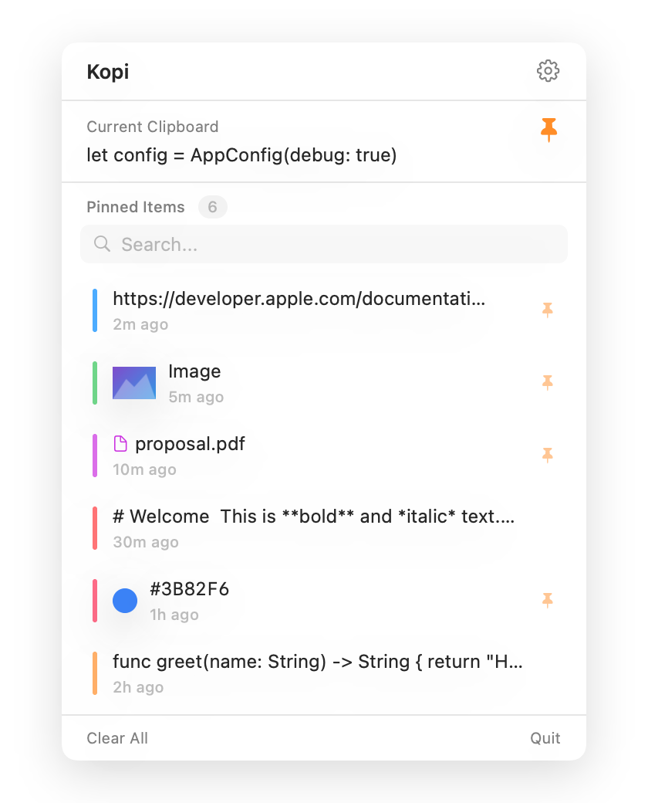
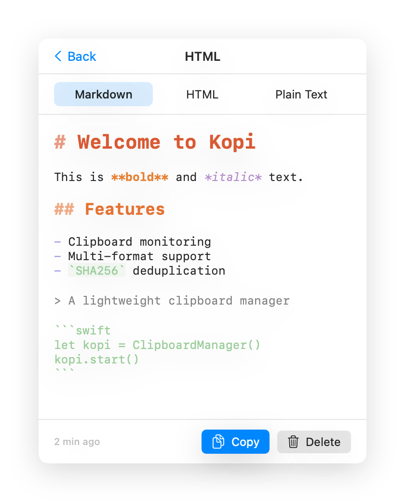
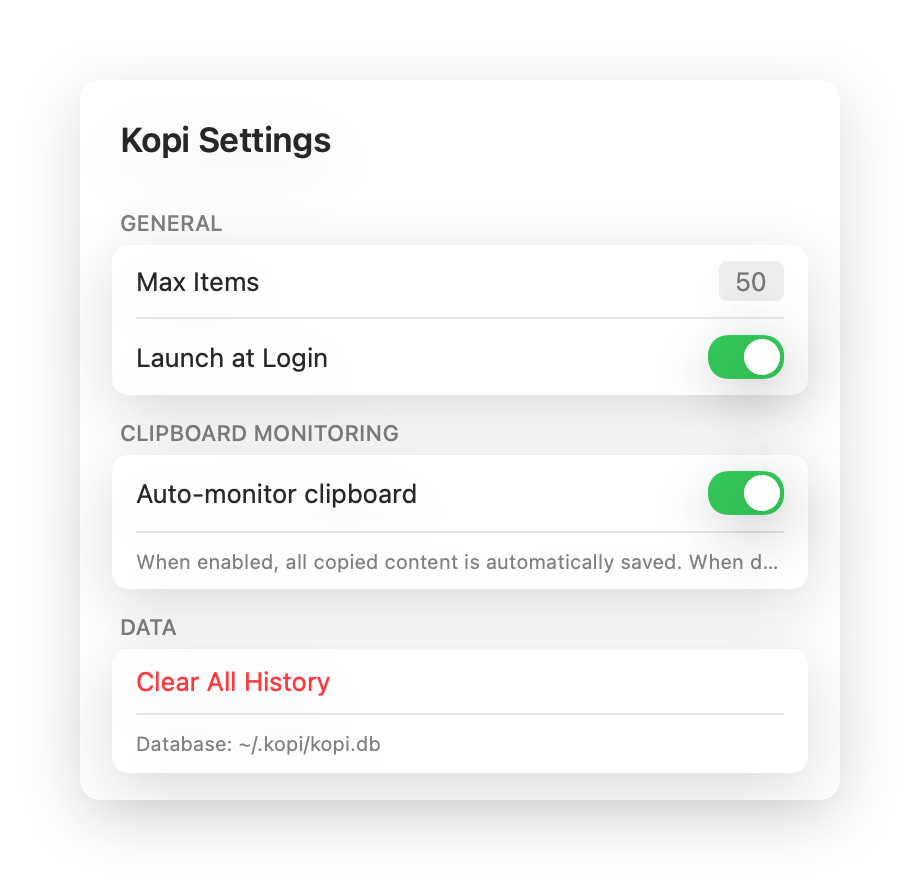

<p align="center">
  
</p>

<h1 align="center">Kopi</h1>

<p align="center">A lightweight macOS menu bar clipboard manager built with SwiftUI.</p>

Kopi lives in your menu bar, silently monitoring your clipboard and keeping a searchable history of everything you copy — text, images, files, HTML, colors, and more.

## Features

- **Menu Bar App** — Runs quietly in the menu bar, always one click away
- **Auto-Save** — Automatically captures clipboard changes in the background
- **Multi-Format Support** — Handles text, URLs, images, files, HTML/RTF, and colors
- **Smart Detection** — Identifies content types from the pasteboard and stores them appropriately
- **Search** — Quickly filter your clipboard history
- **HTML to Markdown** — Converts copied HTML to readable Markdown with syntax highlighting
- **Privacy-Aware** — Skips concealed content from password managers (1Password, etc.)
- **Deduplication** — SHA256-based hashing prevents duplicate entries
- **Pin Items** — Manually pin important clips to keep them around
- **Copy in Multiple Formats** — HTML items can be copied as Markdown, plain text, raw HTML, or original rich text
- **Launch at Login** — Optional auto-start when you log in
- **Lightweight** — Local SQLite database, no cloud, no telemetry

## Screenshots

| Main View | HTML Detail | Settings |
|:---------:|:-----------:|:--------:|
|  |  |  |

## Supported Content Types

| Type | Detection | Preview |
|------|-----------|---------|
| Text | `.string` pasteboard type | Text preview |
| URL | Auto-detected from text | Text preview |
| Image | `.png` / `.tiff` pasteboard types | Thumbnail |
| File | Finder file copy detection | Filename + icon |
| HTML | `.html` pasteboard type | Markdown rendering |
| RTF | `.rtf` pasteboard type | Text preview |
| Color | Color picker pasteboard type | Color swatch + hex |

## Requirements

- macOS 14.0 (Sonoma) or later
- Xcode 15+ to build from source

## Build

```bash
git clone https://github.com/wuwe1/kopi.git
cd kopi
open Kopi.xcodeproj
```

Build and run from Xcode (⌘R).

## Architecture

```
Kopi/
├── App/           → App entry point (MenuBarExtra)
├── Models/        → ClipboardItem, AppSettings
├── ViewModels/    → ClipboardViewModel
├── Views/         → SwiftUI views
├── Services/      → ClipboardService, ClipboardMonitor
├── Database/      → GRDB (SQLite) persistence
└── Utilities/     → HTMLToMarkdown, MarkdownHighlighter
```

## Data Storage

- **Database:** `~/.kopi/kopi.db` (SQLite via GRDB)
- **Settings:** UserDefaults

## License

[MIT](LICENSE)
